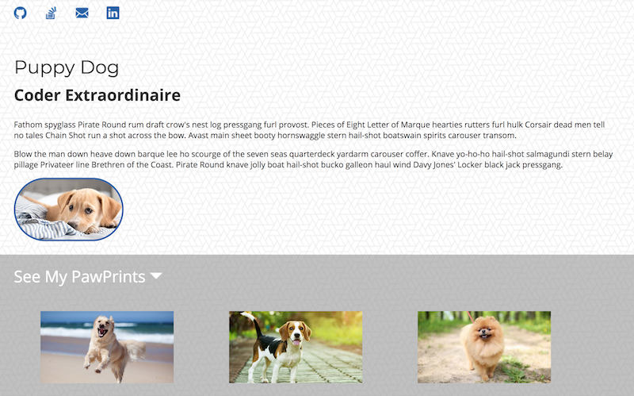

# Portfolio

A web development activity with the object to create a functional portfolio matching the provided design files.   

The design process will build over two weeks: 

*Week One*, work on completing the first portion of your portolio. What you're turning in this week should look like the image below.

# Linking Assets

* Reference articles on how to link to images in the `assets` folder 

  * [https://www.w3schools.com/html/html_filepaths.asp](https://www.w3schools.com/html/html_filepaths.asp)

  * [https://css-tricks.com/quick-reminder-about-file-paths/](https://css-tricks.com/quick-reminder-about-file-paths/)

# Guidelines HTML

* In `index.html`, use semantic HTML to add the following

  * Four icons (github, email, stackoverflow, linkedin) (included in assets)

  * Name

  * A Short Title like `Software Developer`, `Front-End Developer`, `JavaScript Nerd`, or the like 

  * A couple short description paragraphs

  * Some text that says `See My Work` or `View Portfolio` or something similar with an arrow beside it (arrow included assets)

  * A picture 

  * 3 sample portfolio images (included in assets)

  * A footer with a copyright

# Guidelines for CSS

* In the `style.css` do all of the following:

  * Use the Google Font `Monserrat` for headers and `Open Sans` for all other text.

  * Set the background of the whole document to the `bckgrnd.png` image in assets. Make sure the background repeats.

  * The lower section of the page should have a background color `#969696` with 60% opactity (rgb 150, 150, 150). 

  * Add a `3px` border to your profile picture with the color `#2c5fa8` (you'll need to Google the terms CSS IDs and Classes to target this specific image.)

  * Add a width of `200px`to your profile picture and a border radius of `100px` (bonus points if you crop the image to be a square and make a circle with the border radius) 

  * Add a white top border to your footer.

  * Add the appropriate color for text in the top and bottom sections, `#333333` and `#FFFFFF`. 

  * Set appropriate margins, padding, and widths to match the image below.